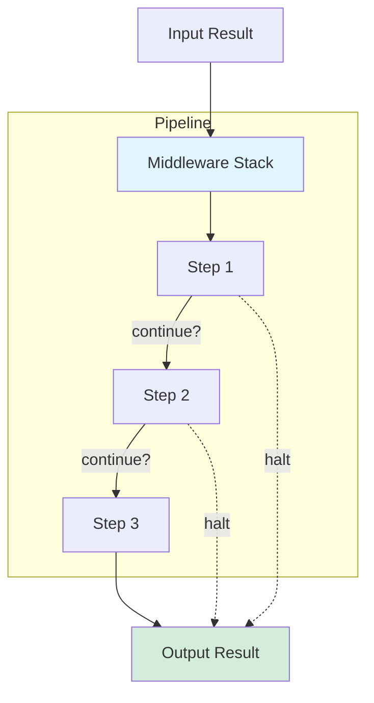
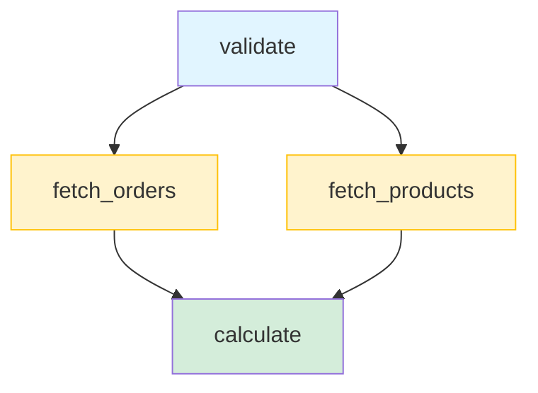
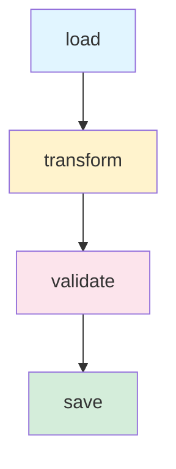
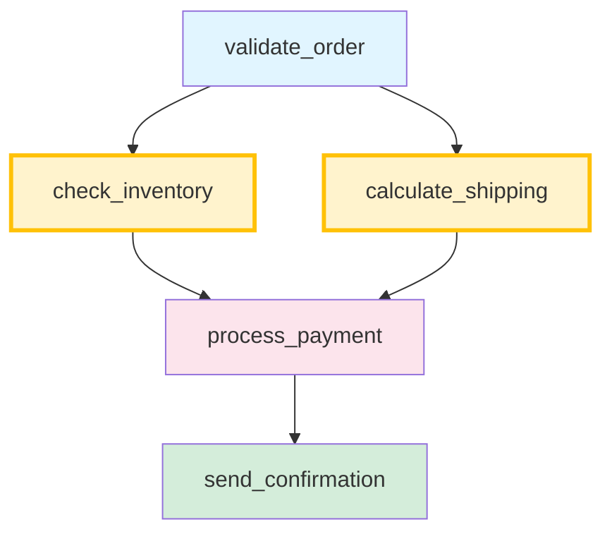

# SimpleFlow

[](https://www.ruby-lang.org)
[](https://github.com/MadBomber/simple_flow)
[](https://github.com/MadBomber/simple_flow)
[](https://madbomber.github.io/simple_flow)
[](LICENSE)

A lightweight, modular Ruby framework for building composable data processing pipelines with middleware support, flow control, and parallel execution.

📚 **[Full Documentation](https://madbomber.github.io/simple_flow)** | 🚀 **[Getting Started](https://madbomber.github.io/simple_flow/getting-started/quick-start/)** | 📖 **[API Reference](https://madbomber.github.io/simple_flow/api/result/)**

## Overview

SimpleFlow provides a clean architecture for orchestrating multi-step workflows with:

- **Immutable Results** - Thread-safe value objects
- **Composable Steps** - Mix and match processing units
- **Flow Control** - Built-in halt/continue mechanisms
- **Middleware Support** - Cross-cutting concerns via decorator pattern
- **Parallel Execution** - Automatic and explicit concurrency
- **Visualization** - Export pipelines to Graphviz, Mermaid, HTML

## Installation

Add to your `Gemfile`:

```ruby
gem 'simple_flow'

# Optional: for fiber-based concurrency (recommended for I/O-bound tasks)
gem 'async', '~> 2.0'
```

Then run:

```bash
bundle install
```

**Note on Parallel Execution:**
- **Without** `async` gem: Uses Ruby threads for parallel execution
- **With** `async` gem: Uses fiber-based concurrency (more efficient for I/O-bound operations)

## Quick Start

### Basic Pipeline

```ruby
require 'simple_flow'

pipeline = SimpleFlow::Pipeline.new do
  step ->(result) { result.continue(result.value.strip) }
  step ->(result) { result.continue(result.value.upcase) }
  step ->(result) { result.continue("Hello, #{result.value}!") }
end

result = pipeline.call(SimpleFlow::Result.new("  world  "))
puts result.value  # => "Hello, WORLD!"
```

### Error Handling

**Sequential steps automatically depend on the previous step's success.** When a step halts, the pipeline stops immediately and subsequent steps are not executed.

```ruby
pipeline = SimpleFlow::Pipeline.new do
  step ->(result) {
    puts "Step 1: Validating..."
    if result.value < 18
      return result
        .with_error(:validation, 'Must be 18+')
        .halt  # Pipeline stops here
    end
    result.continue(result.value)
  }

  step ->(result) {
    puts "Step 2: Processing..."  # This never executes if validation fails
    result.continue("Age #{result.value} is valid")
  }
end

result = pipeline.call(SimpleFlow::Result.new(15))
# Output: "Step 1: Validating..."
# (Step 2 is skipped because Step 1 halted)

puts result.continue?  # => false
puts result.errors     # => {:validation=>["Must be 18+"]}
```

## Architecture



## Execution Modes

SimpleFlow supports two execution modes:

### Sequential Steps (Default)

**Unnamed steps execute in order, with each step automatically depending on the previous step's success.**

```ruby
pipeline = SimpleFlow::Pipeline.new do
  step ->(result) { result.continue(result.value.strip) }
  step ->(result) { result.continue(result.value.upcase) }
  step ->(result) { result.continue("Hello, #{result.value}!") }
end

result = pipeline.call(SimpleFlow::Result.new("  world  "))
```

**Key behavior:**
- Steps run one at a time in definition order
- Each step receives the result from the previous step
- If any step halts, the pipeline stops immediately
- No explicit dependencies needed

### Parallel Steps

**Named steps with dependencies run concurrently based on a dependency graph.**

```ruby
pipeline = SimpleFlow::Pipeline.new do
  step :validate, validator, depends_on: None  # Or use []
  step :fetch_a, fetcher_a, depends_on: [:validate]  # Parallel
  step :fetch_b, fetcher_b, depends_on: [:validate]  # Parallel
  step :merge, merger, depends_on: [:fetch_a, :fetch_b]
end

result = pipeline.call_parallel(SimpleFlow::Result.new(data))
```

**Key behavior:**
- Steps run based on dependency graph, not definition order
- Steps with satisfied dependencies run in parallel
- Must explicitly specify all dependencies
- Use `call_parallel` to execute

## Core Concepts

### Result Object

Immutable value object that carries data, context, and errors through the pipeline:

```ruby
result = SimpleFlow::Result.new({ user: 'alice' })
  .with_context(:timestamp, Time.now)
  .with_error(:validation, 'Email required')
  .continue({ user: 'alice', processed: true })
```

**[Learn more →](https://madbomber.github.io/simple_flow/core-concepts/result/)**

### Pipeline

Orchestrates step execution with short-circuit evaluation:

```ruby
pipeline = SimpleFlow::Pipeline.new do
  use SimpleFlow::MiddleWare::Logging
  use SimpleFlow::MiddleWare::Instrumentation, api_key: 'app'

  step ->(result) { validate(result) }
  step ->(result) { process(result) }
  step ->(result) { save(result) }
end
```

**[Learn more →](https://madbomber.github.io/simple_flow/core-concepts/pipeline/)**

### Middleware

Add cross-cutting concerns without modifying steps:

```ruby
class CachingMiddleware
  def initialize(callable, cache:)
    @callable = callable
    @cache = cache
  end

  def call(result)
    cached = @cache.get(cache_key(result))
    return result.continue(cached) if cached

    result = @callable.call(result)
    @cache.set(cache_key(result), result.value)
    result
  end
end

pipeline = SimpleFlow::Pipeline.new do
  use CachingMiddleware, cache: Redis.new
  step ->(result) { expensive_operation(result) }
end
```

**[Learn more →](https://madbomber.github.io/simple_flow/core-concepts/middleware/)**

## Parallel Execution

### Automatic Parallelization

SimpleFlow automatically detects which steps can run in parallel based on dependencies:

```ruby
pipeline = SimpleFlow::Pipeline.new do
  step :validate, ->(r) { validate(r) }, depends_on: None

  # These run in parallel (both depend only on :validate)
  step :fetch_orders, ->(r) { fetch_orders(r) }, depends_on: [:validate]
  step :fetch_products, ->(r) { fetch_products(r) }, depends_on: [:validate]

  # Waits for both parallel steps
  step :calculate, ->(r) { calculate(r) }, depends_on: [:fetch_orders, :fetch_products]
end

result = pipeline.call_parallel(SimpleFlow::Result.new(data))
```

**Note:** For steps with no dependencies, you can use either `depends_on: None` (more readable) or `depends_on: []`.

**Execution flow:**



### Explicit Parallel Blocks

```ruby
pipeline = SimpleFlow::Pipeline.new do
  step ->(r) { validate(r) }

  parallel do
    step ->(r) { r.with_context(:api, fetch_api).continue(r.value) }
    step ->(r) { r.with_context(:db, fetch_db).continue(r.value) }
    step ->(r) { r.with_context(:cache, fetch_cache).continue(r.value) }
  end

  step ->(r) { merge_results(r) }
end
```

### Concurrency Control

Choose the concurrency model per pipeline:

```ruby
# Auto-detect (default): uses async if available, otherwise threads
pipeline = SimpleFlow::Pipeline.new do
  # steps...
end

# Force threads (even if async gem is installed)
user_pipeline = SimpleFlow::Pipeline.new(concurrency: :threads) do
  step :fetch_profile, profile_fetcher, depends_on: []
  step :fetch_settings, settings_fetcher, depends_on: []
end

# Require async (raises error if async gem not available)
batch_pipeline = SimpleFlow::Pipeline.new(concurrency: :async) do
  step :load_batch, batch_loader, depends_on: []
  step :process_batch, batch_processor, depends_on: [:load_batch]
end

# Mix concurrency models in the same application!
user_result = user_pipeline.call_parallel(user_data)    # Uses threads
batch_result = batch_pipeline.call_parallel(batch_data) # Uses async
```

**Concurrency options:**
- `:auto` (default) - Auto-detects best option (async if available, otherwise threads)
- `:threads` - Always uses Ruby threads (simpler, works with any gems)
- `:async` - Requires async gem (efficient for high-concurrency workloads)

**[Learn more →](https://madbomber.github.io/simple_flow/guides/choosing-concurrency-model/)**

**[Parallel execution →](https://madbomber.github.io/simple_flow/concurrent/parallel-steps/)**

## Visualization

Visualize your pipelines to understand execution flow:

```ruby
pipeline = SimpleFlow::Pipeline.new do
  step :load, loader, depends_on: []
  step :transform, transformer, depends_on: [:load]
  step :validate, validator, depends_on: [:transform]
  step :save, saver, depends_on: [:validate]
end

# ASCII visualization
puts pipeline.visualize_ascii

# Export to Graphviz
File.write('pipeline.dot', pipeline.visualize_dot)

# Export to Mermaid
File.write('pipeline.mmd', pipeline.visualize_mermaid)

# View execution plan
puts pipeline.execution_plan
```

**Generated Mermaid diagram:**



**[Learn more →](https://madbomber.github.io/simple_flow/getting-started/examples/)**

## Real-World Example

E-commerce order processing pipeline:

```ruby
pipeline = SimpleFlow::Pipeline.new do
  use SimpleFlow::MiddleWare::Logging
  use SimpleFlow::MiddleWare::Instrumentation, api_key: 'orders'

  step :validate_order, ->(r) {
    # Validation logic
    r.continue(r.value)
  }, depends_on: []

  # Run in parallel
  step :check_inventory, ->(r) {
    inventory = InventoryService.check(r.value[:items])
    r.with_context(:inventory, inventory).continue(r.value)
  }, depends_on: [:validate_order]

  step :calculate_shipping, ->(r) {
    shipping = ShippingService.calculate(r.value[:address])
    r.with_context(:shipping, shipping).continue(r.value)
  }, depends_on: [:validate_order]

  # Wait for parallel steps
  step :process_payment, ->(r) {
    payment = PaymentService.charge(r.value, r.context)
    r.with_context(:payment, payment).continue(r.value)
  }, depends_on: [:check_inventory, :calculate_shipping]

  step :send_confirmation, ->(r) {
    EmailService.send_confirmation(r.value, r.context)
    r.continue(r.value)
  }, depends_on: [:process_payment]
end
```

**Execution flow:**



## Testing

SimpleFlow has excellent test coverage:

```bash
bundle exec rake test
```

**Test Results:**
- ✅ 134 tests passing
- ✅ 480 assertions
- ✅ 95.57% line coverage

**[Testing Guide →](https://madbomber.github.io/simple_flow/development/testing/)**

## Documentation

📚 **Comprehensive documentation available at [madbomber.github.io/simple_flow](https://madbomber.github.io/simple_flow)**

### Key Resources

- [Getting Started Guide](https://madbomber.github.io/simple_flow/getting-started/quick-start/) - Quick introduction
- [Core Concepts](https://madbomber.github.io/simple_flow/core-concepts/overview/) - Understanding the fundamentals
- [Parallel Execution](https://madbomber.github.io/simple_flow/concurrent/parallel-steps/) - Concurrent processing
- [Guides](https://madbomber.github.io/simple_flow/guides/error-handling/) - Error handling, validation, workflows
- [API Reference](https://madbomber.github.io/simple_flow/api/result/) - Complete API documentation
- [Contributing](https://madbomber.github.io/simple_flow/development/contributing/) - How to contribute

## Examples

Check out the `examples/` directory for comprehensive examples:

1. `01_basic_pipeline.rb` - Basic sequential processing
2. `02_error_handling.rb` - Error handling patterns
3. `03_middleware.rb` - Middleware usage
4. `04_parallel_automatic.rb` - Automatic parallel discovery
5. `05_parallel_explicit.rb` - Explicit parallel blocks
6. `06_real_world_ecommerce.rb` - Complete e-commerce workflow
7. `07_real_world_etl.rb` - ETL pipeline example
8. `08_graph_visualization.rb` - Manual visualization
9. `09_pipeline_visualization.rb` - Direct pipeline visualization
10. `10_concurrency_control.rb` - Per-pipeline concurrency control
11. `11_sequential_dependencies.rb` - Sequential step dependencies and halting
12. `12_none_constant.rb` - Using the `none` helper for cleaner syntax

## Requirements

- Ruby 3.2 or higher
- Optional: `async` gem (~> 2.0) for parallel execution

## License

MIT License - See [LICENSE](LICENSE) file for details

## Contributing

Contributions welcome! See [CONTRIBUTING.md](https://madbomber.github.io/simple_flow/development/contributing/) for guidelines.

## Links

- 🏠 [Homepage](https://github.com/MadBomber/simple_flow)
- 📚 [Documentation](https://madbomber.github.io/simple_flow)
- 🐛 [Issue Tracker](https://github.com/MadBomber/simple_flow/issues)
- 📝 [Changelog](CHANGELOG.md)

---

**Made with ❤️ by [Dewayne VanHoozer](https://github.com/MadBomber)**
