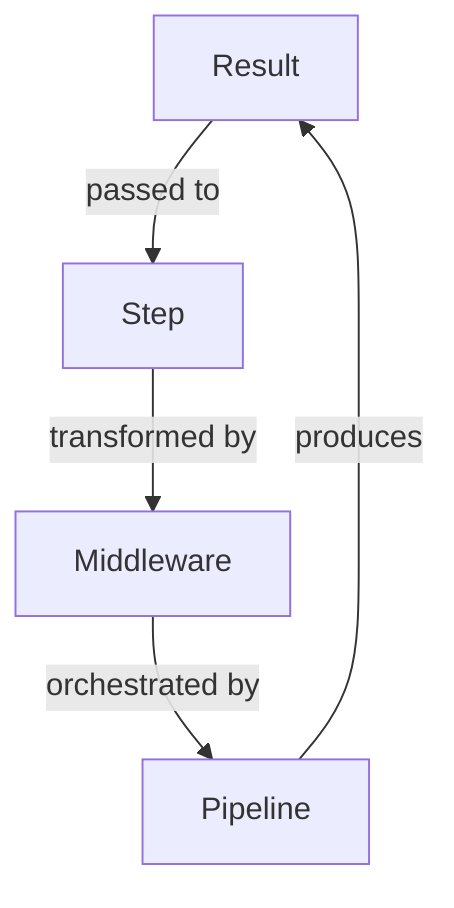
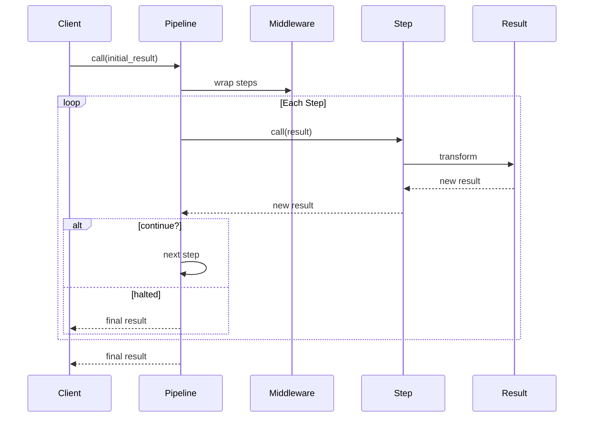

# Core Concepts

Understanding SimpleFlow's fundamental concepts will help you build robust pipelines.

## Architecture

SimpleFlow is built on four core components:



### 1. Result

An **immutable value object** that carries:
- **Value**: The data being processed
- **Context**: Metadata accumulated during processing
- **Errors**: Validation or processing errors
- **Continue Flag**: Whether to continue pipeline execution

[Learn more about Results](result.md)

### 2. Step

A **callable object** (usually a lambda) that:
- Receives a Result
- Performs some operation
- Returns a new Result

[Learn more about Steps](steps.md)

### 3. Pipeline

An **orchestrator** that:
- Holds a sequence of steps
- Applies middleware to steps
- Executes steps in order
- Short-circuits on halt

[Learn more about Pipelines](pipeline.md)

### 4. Middleware

A **decorator** that:
- Wraps steps with additional behavior
- Adds cross-cutting concerns (logging, timing, etc.)
- Applied in reverse order to all steps

[Learn more about Middleware](middleware.md)

## Data Flow

Here's how data flows through a pipeline:



## Key Principles

### Immutability

Results are **never modified**, only **copied with changes**:

```ruby
original = SimpleFlow::Result.new(42)
updated = original.continue(43)

original.value  # => 42 (unchanged)
updated.value   # => 43 (new object)
```

This makes pipelines thread-safe and easier to reason about.

### Composability

Steps are **simple, reusable functions**:

```ruby
# Define reusable steps
validate_email = ->(result) { ... }
validate_age = ->(result) { ... }
validate_password = ->(result) { ... }

# Compose into pipelines
pipeline1 = SimpleFlow::Pipeline.new do
  step validate_email
  step validate_age
end

pipeline2 = SimpleFlow::Pipeline.new do
  step validate_email
  step validate_password
end
```

### Flow Control

Steps decide whether the pipeline should **continue or halt**:

```ruby
step ->(result) {
  if condition_met?
    result.continue(new_value)  # Continue to next step
  else
    result.halt(value).with_error(:key, "message")  # Stop pipeline
  end
}
```

### Context Accumulation

Metadata accumulates across steps:

```ruby
pipeline = SimpleFlow::Pipeline.new do
  step ->(result) { result.with_context(:step1, "data").continue(result.value) }
  step ->(result) { result.with_context(:step2, "more").continue(result.value) }
end

result = pipeline.call(SimpleFlow::Result.new(42))
result.context  # => {:step1=>"data", :step2=>"more"}
```

## Design Patterns

SimpleFlow implements several design patterns:

### Pipeline Pattern
Sequential processing with short-circuit capability.

### Decorator Pattern
Middleware wraps steps to add behavior without modifying them.

### Immutable Value Object
Results are never modified, preventing side effects.

### Builder Pattern
DSL for intuitive pipeline configuration.

### Chain of Responsibility
Each step can handle or pass along the result.

## Common Patterns

### Validation Pipeline

```ruby
pipeline = SimpleFlow::Pipeline.new do
  step ->(result) { validate_required_fields(result) }
  step ->(result) { validate_format(result) }
  step ->(result) { validate_business_rules(result) }

  step ->(result) {
    # Halt if any errors accumulated
    result.errors.any? ? result.halt : result.continue(result.value)
  }
end
```

### Data Transformation Pipeline

```ruby
pipeline = SimpleFlow::Pipeline.new do
  step ->(result) { parse_input(result) }
  step ->(result) { transform_data(result) }
  step ->(result) { format_output(result) }
end
```

### Enrichment Pipeline

```ruby
pipeline = SimpleFlow::Pipeline.new do
  step ->(result) { fetch_base_data(result) }

  parallel do
    step ->(result) { enrich_with_user_data(result) }
    step ->(result) { enrich_with_order_data(result) }
    step ->(result) { enrich_with_analytics(result) }
  end

  step ->(result) { aggregate_enrichments(result) }
end
```

## Next Steps

Explore each component in detail:

- [Result API](result.md) - Immutable value objects
- [Pipeline API](pipeline.md) - Orchestrating steps
- [Steps Guide](steps.md) - Writing effective steps
- [Middleware Guide](middleware.md) - Cross-cutting concerns
- [Flow Control](flow-control.md) - Halting and continuing
